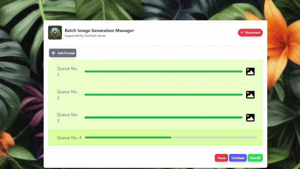

# Comfyui Batch Image Generation
A web application which manages batch image generation via the ComfyUI API and websocket interfaces.🤖

## Demo⚡️
Here's a simple [demo](https://huggingface.co/spaces/rsandagon/comfyui-batch-image-generation/raw/main/demo.gif) on how to run multiple image generations with the tool. Run once, and leave it for later.



## Usage
1. Click the `Add Prompt` button. This will display the workflow editor.
1. Paste your workflow and modify it as needed. 
1. Click `Save Workflow` to add the workflow to the queue.
1. You may remove or add new workflow as required.
1. Click `Connect` to connect to the ComfyUI websocket server.
1. Click `Run All` to run all queues, or click `Continue` to continue previously interrupted processing. You may also `pause` the queued processing anytime you want. All states are saved via localstorage for when you want to resume for a later time.


## Installation 
Download this repo or clone via

```bash
git clone git@github.com:rsandagon/comfyui-batch-image-generation.git
```
*⚠️ Note: This application requires a previously running ComfyUI server. Please see [ComfyUI Installation](https://github.com/comfyanonymous/ComfyUI#installing) for instructions. *

Once downloaded. Extract the files to your Comfy directory `<Installation Path>\ComfyUI\web`

You may now run the application using the url `http://127.0.0.1:8188/batch.htm`.


## Frequently Asked Questions

**How to download COmfyUI workflows in api format?**
From `comfyanonymous` notes, simply enable to "enable dev mode options"
in the settings of the UI (gear beside the "Queue Size: "). This will add
a button on the UI to save workflows in api format.

**How to connect to ComfyUI running in a different server?**
You may modify the `var COMFTY_URL = "http://127.0.0.1:8188"` from `app.js` to point to the server. Note that you will be needing to configure the websocket connection and the API fetchsing depending on the CORS support and authentication.

## Resources
[Animatronext](https://www.youtube.com/@animatronext) 🚧 I'll be posting demo videos and sample usage soon!

## Acknowledgements
1. [Comfyanonymous](https://github.com/comfyanonymous) for providing an amazing tool that is ComfyUI! Thank you!🙇‍♀️
2. CompVis, [StableDiffusion team](https://huggingface.co/CompVis) for continuing to maintain StableDiffuion models and having it opensourced.
3. Hugging Face [Optimum](https://github.com/huggingface/optimum) team for making the BetterTransformer API so easily accessible.

